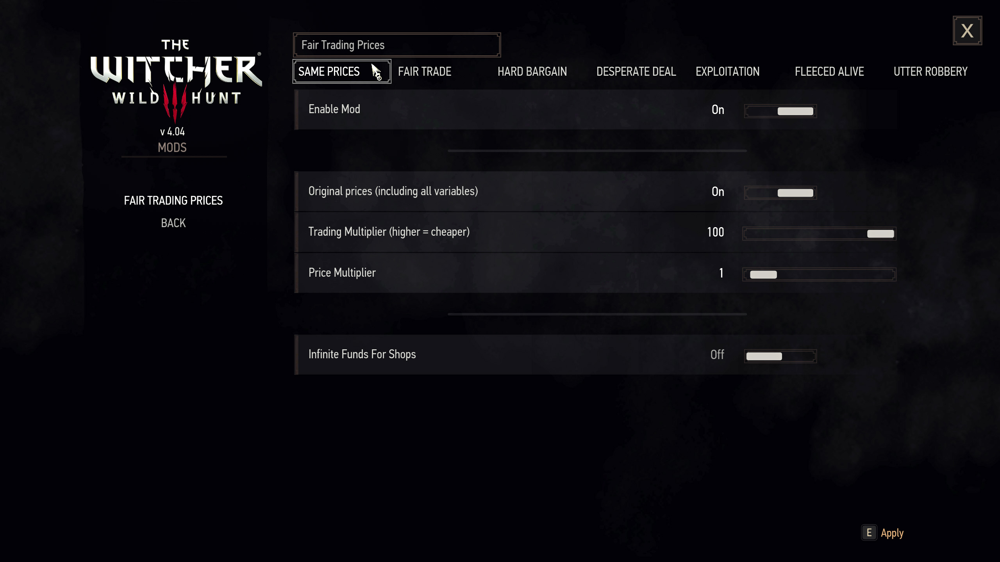
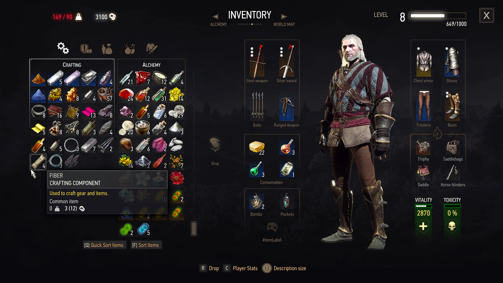
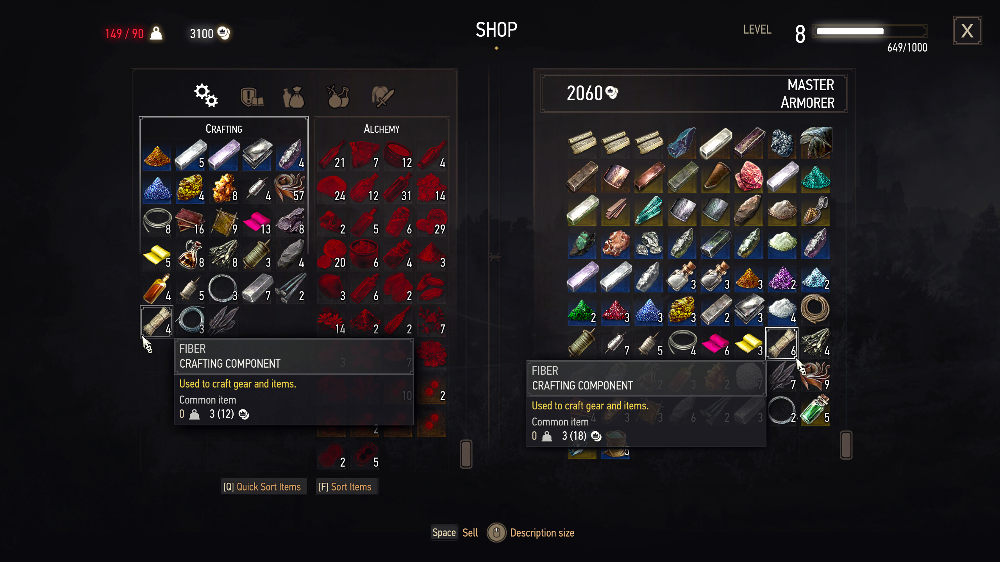
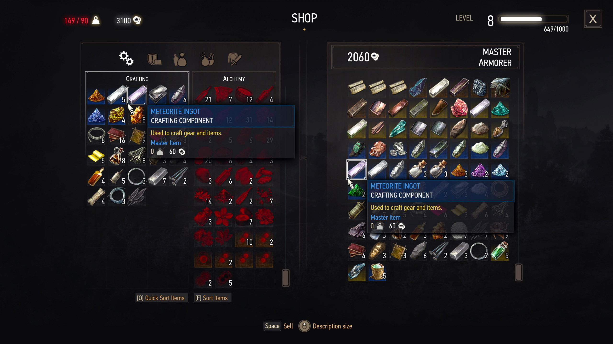

# Fair Trading Prices (Witcher 3 Mod)

A configurable mod for The Witcher 3 that rebalances item trade values, allowing players to tweak how much gold they receive when selling items. It offers a more immersive, fair, or punishing economy based on your preferences - with multiple difficulty presets, optional infinite money for merchants, and full in-game configurability.

## Note
All changes made by this mod are based on the clean, unmodified Witcher 3 game code, without any leftovers or dependencies from other mods. This ensures maximum compatibility and stability.

## Features

* Toggle between original prices and mod-adjusted prices
* Adjustable price modifier
  * from 10 = less profit for player
  * to 100 = same as shop price
* Adjustable price multiplier (from 0.5, to 10)
  * from 0.5 = lower prices
  * to 10 = higher prices
* Optional infinite money for merchants
* Fully configurable in-game via mod settings menu
* Multiple presets included

## Sreenshots

  
  
  
  

## Presets

  | Name               | Modifier | Description                                                                                       |
  |--------------------| -------- | ------------------------------------------------------------------------------------------------- |
  | **Same Prices**    | 100%     | Items are sold at full price - same as merchants pay. Perfect for testing or cheat-like fairness. |
  | **Fair Trade**     | 80%      | Balanced gameplay - merchants offer most of the item's value. Recommended default.                |
  | **Hard Bargain**   | 70%      | Merchants pay less, representing tougher negotiations or market pressure.                         |
  | **Desperate Deal** | 50%      | Merchants only pay half the item's value. Use when gold should feel more earned.                  |
  | **Exploitation**   | 40%      | Severe profit loss when selling - reflects a merchant-dominated economy.                          |
  | **Fleeced Alive**  | 30%      | You're being ripped off. Only a third of the value is returned on sale.                           |
  | **Utter Robbery**  | 20%      | Brutal setting - merchants exploit you fully. Gold is hard to come by.                            |

## Installation

1. **Extract the contents into the `mods` folder**  
   Folder: `The Witcher 3\mods\mod000FairTradingPrices`
2. **Copy the contents of the `bin` folder into the game's main `bin` directory**
3. **Add the mod `FairTradingPrices.xml` line to both the `dx11filelist.txt` and `dx12filelist.txt`**  
   Folder: `The Witcher 3\bin\config\r4game\user_config_matrix\pc`
   * This adds the mod menu configuration for in-game access
4. **Launch the game and open the mod menu to adjust settings**

## Localization

* Current translations included:
  * English
  * Russian
  * Polish
* Translations are managed via CSV files.
* Check the `localization` folder and see the internal README for instructions on compiling or submitting translations.
* Compiled `.w3strings` are required for translations to take effect.

## Contributing Translations

* Edit the appropriate CSV file in the `translations` folder
* Compile your changes using `#ConvertCSVtoWS.bat`
* Submit a [GitHub pull request](https://github.com/SergeiBabko/Witcher3-FairTradingPrices/pulls) or [open an issue](https://github.com/SergeiBabko/Witcher3-FairTradingPrices/issues) with your translated files

## Credits

Original Mod Author: [GitHub](https://github.com/SergeiBabko) | [NexusMods](https://next.nexusmods.com/profile/Segich)  
Original Mod Link: [NexusMods FTP Mod](https://www.nexusmods.com/witcher3/mods/10941)  
Original Repository: [Witcher3-FairTradingPrices on GitHub](https://github.com/SergeiBabko/Witcher3-FairTradingPrices)  
Special Thanks: [ScriptMerger](https://www.nexusmods.com/witcher3/mods/484) | [w3strings encoder](https://www.nexusmods.com/witcher3/mods/1055)  
